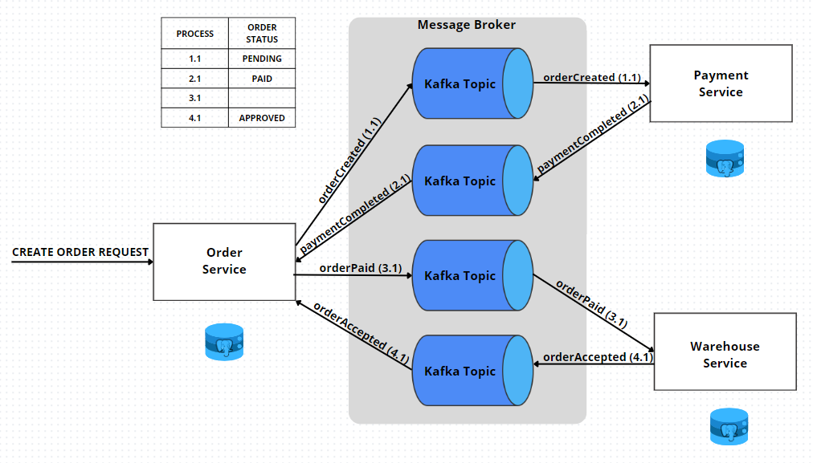

# Product ordering system

1. [Introduction](#introduction)
2. [Technology stack](#technology-stack)
3. [Architecture overview](#architecture-overview)
4. [Used patterns](#used-patterns)
   * [Hexagonal Architecture](#hexagonal-architecture)
   * [Saga Pattern](#saga-pattern)
   * [Outbox Pattern](#outbox-pattern)
5. [Domain-driven design](#domain-driven-design)
6. [How to run](#how-to-run)
7. [Application overview](#application-overview)


## Introduction
Example application used to order various products. The application has basic functionality for ordering products.
The main goal of this project was to create microservices system in *Event-Driven Architecture* style.
The fact of creating this application caused that I gained a lot of valuable knowledge.
I am passionate about microservice architecture and I want to expand my knowledge in this area.

## Technology stack
* Java 19
* Spring Framework / Spring Boot 
* Hibernate
* Kafka
* PostgreSQL
* Docker
* Gradle
* ArchUnit
* JUnit
* AssertJ

## Architecture overview
The application consists of 3 separate microservices. Each of them communicates asynchronously using *Kafka*.


The application is divided into several modules:
* common - the microservice shared by other microservices,
* infrastructure - the microservice holds infrastructure (*Docker*, *Kafka*) and core *Saga* and *Outbox* patterns,
* order-service - the microservice responsible for creating orders and viewing order status, 
* payment-service - the microservice responsible for payment process,
* warehouse-service - the microservice responsible for final approval of the order.

## Used patterns

### Hexagonal Architecture
The *Hexagonal Architecture* or ports and adapters architecture, is an architectural pattern used in software design. It aims at creating loosely coupled application components.
This pattern separate core business logic from other dependencies (like concrete database engine). Allows to postpone implementation of concrete adapters.
Ports are nothing more than interfaces that allow to communicate with application. 
Adapters implement the interfaces defined by the ports and connect whole application with outside world (e.g. *REST API*)

The concept is well represented by the diagram below:


###### Source: https://herbertograca.com/2017/11/16/explicit-architecture-01-ddd-hexagonal-onion-clean-cqrs-how-i-put-it-all-together/

The above diagram can be overwhelming due to the complexity. For the sake of simplicity, I have prepared a simplified version of the above diagram.


Each microservice has arranged structure of modules:


* ### Domain
The module contains two submodules:
* ##### Domain-core
It is the heart of each microservice. This layer is framework-agnostic and does not depend on other layers.
This module holds business rules and invariants. 
* ##### Application-service
The layer contains ports that describe how domain can be used. In this submodule are placed application services
that control the flow of data. It has dependency to _**Domain-core**_ submodule and directs operations to domain objects.
Consists things related to the technical aspects of the application.
Uses framework to conduct transactional process.
* ### Entities
The layer contains database model, e.g. *JPA* entities.
* ### Adapters
The layer which is responsible for communication with external entities driving and driven the application e.g. *Apache Kafka*,
*REST API*, *PostgreSQL*.
* ### Container
The module holds everything together. It is responsible for microservice launching and parameters configuration.

To ensure that principles of *Hexagonal Architecture* are followed, in each microservice _**Container**_ module contains
architecture tests using *ArchUnit* tool.

```java 
    @Test
    void domainLogicShouldBeSpringFrameworkAgnostic() {
        noClasses()
                .that()
                .resideInAPackage("..domain..")
                .should()
                .dependOnClassesThat()
                .resideInAPackage("org.springframework..")
                .check(new ClassFileImporter().importPackages("com.product.ordering"));
    }
```

```java
    @Test
    void applicationModuleShouldNotDependOnAdaptersModule() {
        noClasses()
                .that()
                .resideInAnyPackage("..application..")
                .should()
                .dependOnClassesThat()
                .resideInAPackage("..adapters..")
                .check(new ClassFileImporter().importPackages(PAYMENT_SERVICE_PACKAGE));
    }

    @Test
    void applicationModuleShouldNotDependOnEntitiesModule() {
        noClasses()
                .that()
                .resideInAPackage("..application..")
                .should()
                .dependOnClassesThat()
                .resideInAPackage("..entities..")
                .check(new ClassFileImporter().importPackages(PAYMENT_SERVICE_PACKAGE));
    }

    @Test
    void applicationModuleShouldNotDependOnContainerModule() {
        noClasses()
                .that()
                .resideInAPackage("..application..")
                .should()
                .dependOnClassesThat()
                .resideInAPackage("..container..")
                .check(new ClassFileImporter().importPackages(PAYMENT_SERVICE_PACKAGE));
    }
```

### Saga Pattern
A saga is a sequence of local transactions. Each local transaction updates the database and publishes a message or event to trigger the next local transaction in the saga.
If a local transaction fails because it violates a business rule then the saga executes a series of compensating transactions that undo the changes that were made by the preceding local transactions.
There are two ways of coordination sagas:
* **Choreography** - each local transaction within a given microservice publishes domain events that trigger local transactions in other microservices.
There is no centralized control point like in *Orchestration* approach.
* **Orchestration** - an orchestrator (particular microservice) tells the participants (other microservices) what local transaction to execute.
The orchestrator is a central point and is responsible for managing the overall transaction status.

How *Choreography* or *Orchestration* could be implemented in this application?

It is worth recalling what a command and an event are.
* command - The command (message) represents the intention. The command tells the consumer what to do. Should have only one consumer.
* event - The event (message), represents a fact in the past. Event may have from _0_ to _n_ consumers.

**Choreography approach**:


1. The Order service receives a request to create an order.
2. The Order service creates an order and publishes an event named orderCreated. This event is read by the Payment service.
3. The Payment service conducts payment process and publishes an event named paymentCompleted. This event is read by the
Order service in which order status is changed to PAID. This event is also read by Warehouse service.
4. The Warehouse service approves the order and publishes an event orderAccepted. This event is read by Order service.
5. Finally, Order service changes an order status to APPROVED.

**Orchestration approach**:


1. The Order service receives a request to create an order.
2. The Order service creates an order and publishes an event named orderCreated. This event is read by the Orchestrator service.
3. The Orchestrator service publishes a command executePayment. This command is read by the Payment service.
4. The Payment service conducts payment process and publishes an event paymentCompleted. This event is read by the Orchestrator service.
5. The  Orchestrator service publishes a command setOrderStatusToPaid. This command is read by the Order service.
6. The Order service changes an order status to PAID and publishes an event orderPaid. This event is read by the Orchestrator service.
7. The Orchestrator service publishes a command acceptOrder. This command is read by the Warehouse service.
8. The Warehouse service approves an order and publishes an event orderAccepted. This event is read by the Orchestrator service.
9. The Orchestrator service publishes a command setOrderStatusToApproved. This command is read by the Order service.
10. The Order service changes an order status to APPROVED and publishes an event orderApproved. This event is read by the Orchestrator service.
11. Finally, the Orchestrator service marks saga as completed.

**Choreography**:
* contains only events,
* faster,
* requires less effort to implement,
* hard to maintain,
* compensation process is difficult to perform,
* not clear what the current status of the process is.

**Orchestration**:
* contains commands and events,
* slower,
* require more effort to implement (additional service),
* compensation process is relatively straightforward,
* the current status of the process is known.

Both approaches were used in the application. The Order service plays the role of orchestrator. In this approach only events
are used. Thanks to this adding new microservices will not require code modification.


1. The Order service receives a request to create an order.
2. The Order service creates an order and publishes an event named orderCreated. Order status has PENDING state. This event is read by the Payment service.
3. The Payment service conducts payment process and publishes an event named paymentCompleted. This event is read by the Order service.
4. The Order service changes an order status to PAID and publishes an event orderPaid. This event is also read by the Warehouse service.
5. The Warehouse service approves the order and publishes an event orderAccepted. This event is read by the Order service.
6. Finally, Order service changes an order status to APPROVED.

The unavailability of any microservice is also not a problem for asynchronous communication. When microservice will come back to life, then saga will continue.
But how to deal with the unavailability of the message broker?

A microservice command typically needs to perform some operations on aggregates in the database and send events to a message broker.
One can imagine a situation in which Order service receives a request to create an order. The Order service saves an order in the database
and emit orderCreated event. These two processes must be atomic to avoid data inconsistencies. If something goes wrong and the Order service
saves and order in the database but does not emit orderCreated event then the Payment service will not handle the payment process.
On the other hand if the Order service emits orderCreated event but does not save an order in the database then order process will fail.
The Remedy for this issue is *Outbox Pattern*.

### Outbox Pattern
Database (*Postgres*) and message broker (*Apache Kafka*) are two separate tools. There is no assurance that both tools will be available at the same time (e.g. network issues).
The Order service creates an order and saves an order in the database. In the same process, the Order service emits an event to Kafka.
In case when database is unavailable, the application throws appropriate exception and event is not sent. On the other hand, when message broker
is unavailable, the application saves an order in the database but does not emit an event to Kafka. This leaves the system in an inconsistent state.


Database transactionality can be used to make these processes consistent.
Instead of immediately emitting an event to *Kafka*, we can store the order information and the orderCreated event in two separate tables within a single database transaction.


Once the data is stored in the database, application will attempt to emit events to Kafka. In case when something goes wrong, application
will try to emit events again and again because event has been saved in outbox table. Once the application successfully emits this event to *Kafka*,
it can be removed from the database or its status can be changed.

## Domain-driven design
**Domain-driven design** is a software design approach, focusing on modeling software to match a domain according to input
from that domain's experts. This topic is very broad to describe it here. :D

DDD Building blocks used in application.
* [Aggregate](order-service/order-domain/order-domain-core/src/main/java/com/product/ordering/domain/entity/Order.java)
* [Entity](order-service/order-entities/src/main/java/com/product/ordering/entities/entity/OrderEntity.java)
* [Domain Service](order-service/order-domain/order-domain-core/src/main/java/com/product/ordering/domain/OrderDomainService.java)
* [Application Service](order-service/order-domain/order-application-service/src/main/java/com/product/ordering/application/ports/input/OrderApplicationService.java)
* [Value Object](common/common-domain/src/main/java/com/product/ordering/domain/valueobject/Money.java)
* [Repository](order-service/order-adapters/src/main/java/com/product/ordering/adapters/repository/SqlOrderRepository.java)
* [Saga](order-service/order-domain/order-application-service/src/main/java/com/product/ordering/application/saga/OrderPaymentSaga.java)
* [Event](order-service/order-domain/order-domain-core/src/main/java/com/product/ordering/domain/event/OrderPaidEvent.java)

## How to run
To start application, use command `docker compose up` in [docker catalog](infrastructure/docker-compose).

You can also smash the play button in your favourite IDE.


All infrastructure should start up:
* postgres
* zookeeper
* schema-registry
* kafka-broker1
* kafka-broker2
* kafka-manager
* kafka topics initialization

Once all the infrastructure is in place, run 3 microservices (order does not matter)

## Application overview

Password for local database is commented. To set the correct password, changes must be made to the *application.yml* file in each microservice.
When running each microservice, the relevant data will be added to the database. It allows to carry out basic operations.
Example requests:

1. Create order (happy path).
* PATH: **POST** _http://localhost:8001/api/orders_
* Body:

```json
{
   "customerId": "4ece4645-2658-4c54-a182-b0edcfa46d00",
   "warehouseId": "d215b5f8-0249-4dc5-89a3-51fd148cfb11",
   "deliveryAddress": {
        "street": "Spokojna",
        "postalCode": "20-222",
        "city": "Warszawa"
   },
   "currency": "PLN",
   "orderItems" : [
     {  
        "productId": "d215b5f8-0249-4dc5-89a3-51fd148cfb66",
        "quantity": 1,
        "price": 11.50,
        "subtotal": 11.50
     }
    ],
    "paymentMethod": "CASH",
    "deliveryMethod": "PACKAGE_BOX",
    "price": 11.50,
    "coupon": "xsedsda"
}
```

2. Reject order by Warehouse service (Warehouse unavailable).
* PATH: **POST** _http://localhost:8001/api/orders_
* Body:

```json
{
   "customerId": "4ece4645-2658-4c54-a182-b0edcfa46d00",
   "warehouseId": "d215b5f8-0249-4dc5-89a3-51fd148cfb14",
   "deliveryAddress": {
        "street": "Spokojna",
        "postalCode": "20-222",
        "city": "Warszawa"
   },
   "currency": "PLN",
   "orderItems" : [
     {  
        "productId": "d215b5f8-0249-4dc5-89a3-51fd148cfb66",
        "quantity": 1,
        "price": 11.50,
        "subtotal": 11.50
     }
    ],
    "paymentMethod": "CASH",
    "deliveryMethod": "PACKAGE_BOX",
    "price": 11.50,
    "coupon": "xsedsda"
}
```

3. Reject order by Payment service (Not enough money).
* PATH: **POST** _http://localhost:8001/api/orders_
* Body:

```json
{
   "customerId": "4ece4645-2658-4c54-a182-b0edcfa46d00",
   "warehouseId": "d215b5f8-0249-4dc5-89a3-51fd148cfb11",
   "deliveryAddress": {
        "street": "Spokojna",
        "postalCode": "20-222",
        "city": "Warszawa"
   },
   "currency": "PLN",
   "orderItems" : [
     {  
        "productId": "d215b5f8-0249-4dc5-89a3-51fd148cfb66",
        "quantity": 1,
        "price": 11111.50,
        "subtotal": 11111.50
     }
    ],
    "paymentMethod": "CASH",
    "deliveryMethod": "PACKAGE_BOX",
    "price": 11111.50,
    "coupon": "xsedsda"
}
```

4. Get information about the order:
* PATH: **GET** _http://localhost:8001/api/orders/{orderId}_